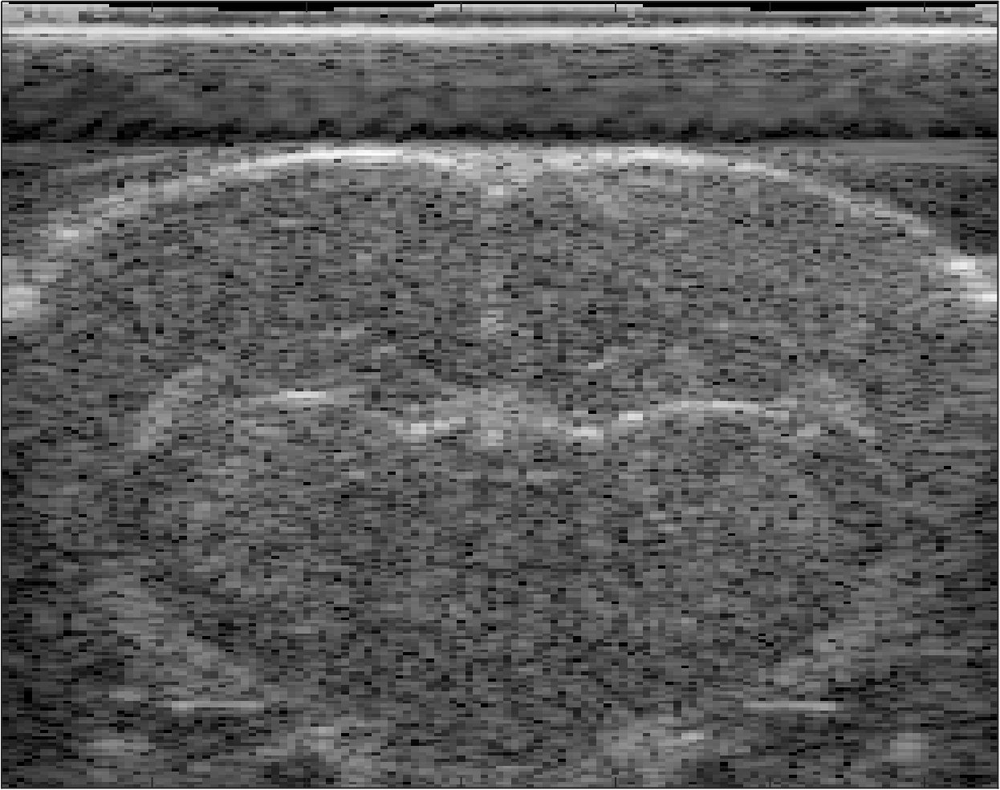

# Reconstruction of Ultrasound Bmode Image using CUDA Library
This program is designed for delay-and-sum reconstruction using the ultrasound raw RF data acquired from Verasonics Ultrasound Platform.

# Usage
- In command window, type in "BeamformingGPU.exe [RF Data Folder Path]"

 

The program will reconstruct all the RF Data saved with .dat suffix. The reconstructed IQ Data will be saved in a separate folder named with the current time stamp.

The RF Data needs to be saved in a one-dimensional vector in the order of [Samples * NumofTransmissions * NumofChannels * NumofFrames]. 

- Before running exe file, the reconstruction program needs the information of transmit and receive time delay and transducer element sensitivity. In the utils folder, genPara.m gives an example of matlab script to generate the required files.

# Example of Reconstructed Image
- Signal acquired from a Rat Brain

Bmode Image 

